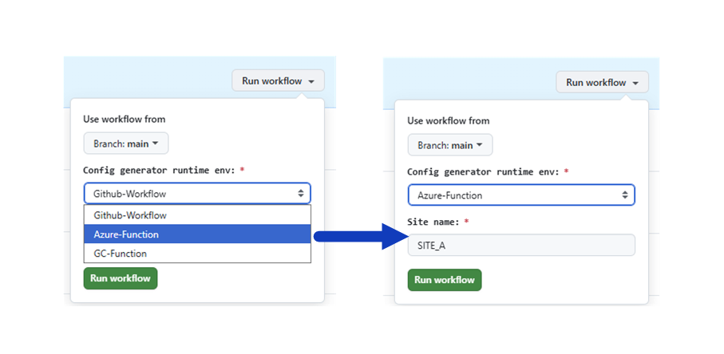

# IAC-SDWAN-config-generator

> [!NOTE]
> For most of my projects, the leading branch is the **dev** one. That means that *_dev.yaml file is the most frequently used workflow/pipeline.  

Initial config is needed when ISP doesn't provide you DHCP based IP address.  
In our case there are two options to generate the config:  
- API call towards Manager to generate full bootstrap config based on existing device configuration  
- create a minimalistic boostrap config based on the data from SD-WAN deploy repository (TODO)  
_To access the repo data, I will use Github fine-grained personal access token.  
Data will be read from a repository: https://github.com/pawel80-dev/IaC-SDWAN-deployment  
File: /tf_sdwan/providers_devices.tf  
Alternative would be to create a separate source file (csv, excel, etc...) for a device variables._  

Bootstrap file will be send to designated email address.  

The whole process could be extended with a few extra steps like Manager - PNP portal sync or attach a template to a new device.  

  
*Config generator: Possible deployment options*

  
*Config generator: Github workflow options*

Config generator, possible deployments (description):  
1. Create the config running python code on your laptop
2. Create the config running Github workflow
3. Create the config running Github workflow - Function   
   a) Azure Function  
   b) Google Cloud Run Function  
